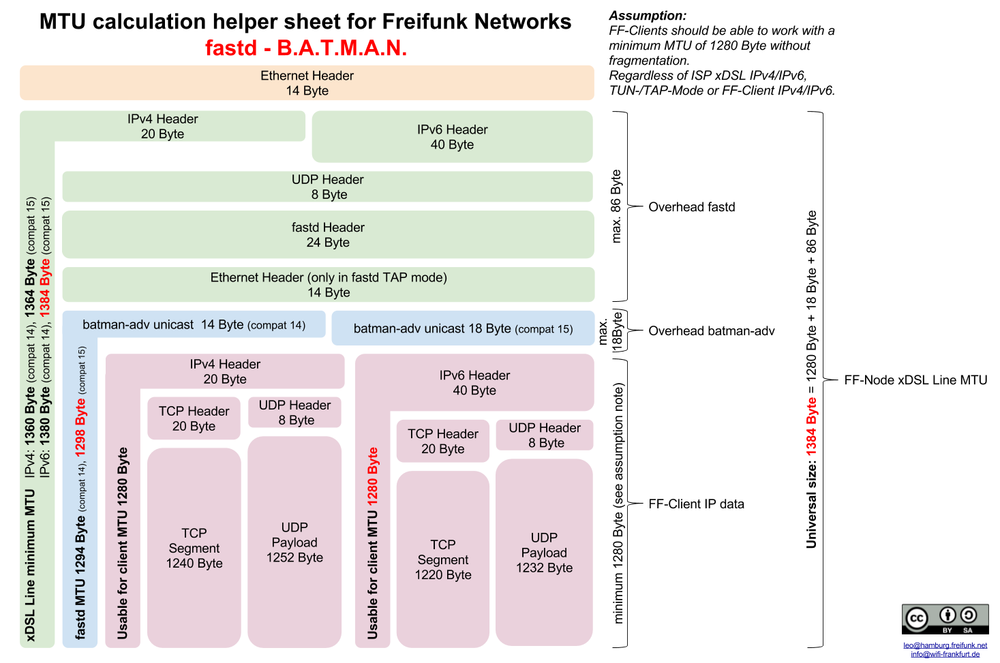
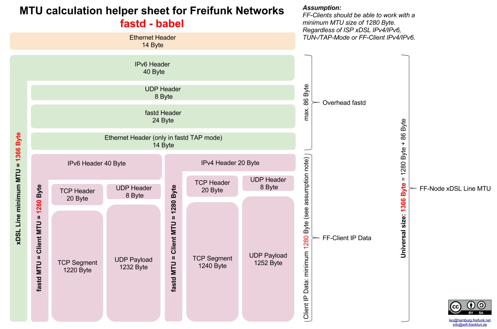

Komponenten des Netzes
======================
Terminologie
------------
===========  ==========================================================================
Begriff      Bedeutung    
===========  ==========================================================================
Node         Freifunk-Router vor Ort    
Gateway      Node mit der Fähigkeit Traffic ans Internet auszuleiten
Client       Rechner eines Nutzers, der mit einem Node verbunden ist.  
===========  ==========================================================================

besondere Adressen/Netze
------------------------
.. csv-table::
 :header-rows: 1
 :delim: ;

 Adresse; Bedeutung
 2a06:8187:fbab:2::1; next-node IP-Adresse: Diese Adresse ist jedem Node zugewiesen. Der Node ist für alle direkt verbundenen Clients unter dieser Adresse erreichbar.
 2a06:8187:fbab:1::/64;   eine bestimmte IP-Adresse in diesem Netz ist die local-node-IP-Adresse. Diese wird anhand der MAC-Adresse des Nodes bestimmt und dem  lokalen Interface "lo" zugewiesen.
 2a06:8187:fbab:1::/64;   Infrastruktur-Netz: In diesem Netz liegen Nodes und Serverkomponenten
 2a06:8187:fbab:2::/64;   Client-Netz: In diesem Netz liegen Clients

Jeder Node und jeder Client ist somit über eine öffentliche IPv6-Adresse erreichbar.  

fastd
-----
Nodes, die keine direkte WLAN-Verbindung haben, können über die VPN-Software fastd Teil eines gemeinsamen Netzes werden.
In einem Batman-Netz werden die IP-Pakete des Freifunk-Netzes in Batman-Frames eingepackt und diese in fastd-Pakete gesteckt.
Im Babel-Netz haben wir eine Verschachtelungsebene weniger, die IP-Pakete aus dem Freifunknetz können direkt auf den fastd-Interfaces transportiert werden.
Die Datenströme zur Verwaltung des Netzes liegen daneben.

Die MTU von fastd berechnet den im fastd-Paket liegenden Ethernet-Header nicht mit ein. Bei einer fastd-MTU von 1288 ist bereits fragmentierungsfreie IPv6-Kommunikation im Netz und außerhalb möglich.
Im Mesh werden durch den mmfd Pakete in UDP-Pakete eingepackt. 1288 ist dadurch die minimale MTU, weil das kleinstmögliche fragmentierungsfreie Paket mit 1280 + 8-Byte UDP-Header über den fastd-Tunnel verschickt werden muss.

Der Einsatz anderer VPN-Technologien (sogar im Parallelbetrieb zu fastd) ist denkbar.
In Frankfurt haben wir uns entschieden nicht zu viele Komponenten gleichzeitig auszutauschen.
Fastd hat sich bewährt.

babeld
------
babeld liest seinen Input für die Optimierung und Verteilung der Routen aus den Tabellen 11 (dorthin schreibt l3roamd) und 12.
Der Rest funktioniert automatisch. Dabei ist auf dem gateway für 2a06:8187:fb00::/40 die folgende Konfiguration ein guter Startwert:

.. code:: sh
 
 reflect-kernel-metric true
 ipv6-subtrees true
 export-table 10
 import-table 11
 import-table 12
 
 interface mesh-vpn-1312
 interface eth2
 redistribute src-prefix 2a06:8187:fb00::/40 metric 25

l3roamd
-------
l3roamd läuft auf jedem Node, damit Clientrouten ermittelt und übermittelt werden können. Weil gegenwärtig l3roamd nicht ohne client-Interface läuft, wird dieses mit "lo" angegeben.
Momentan muss das Kernelmodul CFG80211 geladen sein, damit l3roamd startet.

mmfd
----
mmfd kann genutzt werden um multicast (gegenwärtig Broadcasts) in einem Layer-3-Meshnetz umzusetzen.
Benötigt wird das um respondd auf den Nodes anzustoßen, Daten für die Map und das Monitoring bereitzustellen.

prefixd
-------
Dieser Dienst existiert noch nicht.
TODO sobald sich das ändert, dokumentieren

respondd
--------
Der Dienst wird wie im Batman-Netz auch genutzt um Monitoring und Mapdaten im Netz zu transportieren.
Im Gegensatz zu derzeiten Batman-Netzen kommt der respondd auf einer ff05-Adresse zum Einsatz.

